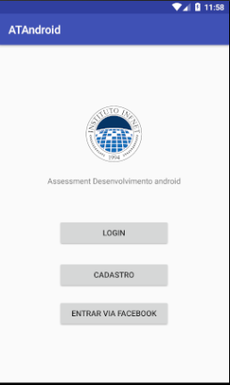

# Acesso a Json ATAndroid
Aplicação simples de login que exemplifica o acesso por email e senha, alem de pelo próprio facebook.
 

## Suporte
+ Android OS 7.0 Nougat
+ Android Studio 3.0
+ Versão SDK 26
+ Versão SDK mínima 25
+ Retrofit

## Instalação
Você pode baixar ou clonar e transformar em apk.

Build → Build APK

## Bibliotecas
+ com.squareup.retrofit2:retrofit:2.3.0
+ com.squareup.retrofit2:converter-gson:2.1.0
+ com.google.firebase:firebase-auth:11.0.4
+ com.google.firebase:firebase-database:11.0.4
+ com.facebook.android:facebook-android-sdk:4.29.0

## Detalhes
Foi feito o uso de uma url para a obtenção do json com Retrofit, mais o acesso ao Firebase para a criação e armazenamento de informações de login do usuário.

## Screenshot

## Licença
Licenciado por [MIT LICENSE](https://github.com/Nabucodono5or/ATAndroid/blob/master/LICENSE)
